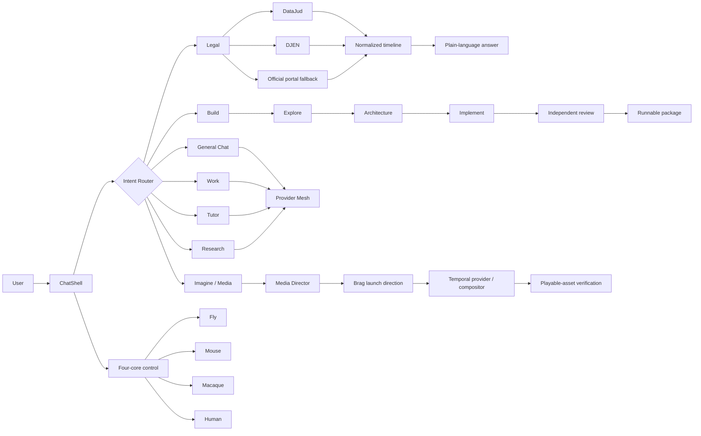

<div align="center">

# PredictLM

### General AI with a legal-first execution path

**Chat · Brazilian legal-process intelligence · Build/Work · Research/Tutor · Media**

A Next.js AI system that keeps one conversational surface while routing complex work into verified, capability-specific pipelines.

**Public surface:** Chat · Jurídico · Imagine

[Architecture](ARCHITECTURE.md) · [Commercial film brief](docs/commercial/predictlm-launch-film.md) · [Agent contract](AGENTS.md) · [PredictLM Master](skills/predictlm-master/SKILL.md)

</div>

<p align="center">
  
</p>

---

## Why PredictLM exists

Most AI products split the experience into disconnected modes: one screen for chat, another for research, another for coding, another for domain work.

PredictLM takes the opposite approach.

The user talks to **one assistant**. The application classifies the job, assembles only the context that matters, selects the execution path, runs the capability, verifies the output and returns to the same conversation.

For Brazilian legal-process work, that means a CNJ number can become a sourced DataJud + DJEN timeline and a plain-language explanation. For software work, the same Chat can inspect a project, plan a change, implement it, review the diff, run deterministic checks and package a runnable project.

The design goal is not “more modes”. It is **fewer product surfaces, stronger execution contracts**.

---

## Product surface

| Surface | Purpose | Loading policy |
| --- | --- | --- |
| **Chat** | General questions, legal work, Build, Work, Research and Tutor | Primary surface |
| **Jurídico** | Chat shortcut for CNJ / DataJud / DJEN workflows | Uses Chat |
| **Imagine** | Lightweight direct image generation | Loaded on demand |

Minecraft, neuroscience experiments, simulation engines, large connectome tooling and legacy specialist UIs remain **internal/lab modules**. They are intentionally kept out of the primary navigation and must not inflate the initial client bundle.

---

## Commercial launch film

PredictLM now carries a Brag-inspired launch-video contract for product commercials.

The creative source of truth is:

- [`docs/commercial/predictlm-launch-film.md`](docs/commercial/predictlm-launch-film.md) — exact 15-second commercial brief;
- [`skills/brag-launch-video/SKILL.md`](skills/brag-launch-video/SKILL.md) — reusable launch-video direction skill;
- [`src/lib/media/video-pipelines.ts`](src/lib/media/video-pipelines.ts) — runtime detection and prompt integration.

The commercial story is deliberately product-first:

```text
PredictLM
  -> Chat
  -> CNJ
  -> DataJud + DJEN
  -> normalized timeline
  -> clear legal explanation
  -> Build / Work / Tutor / Research
  -> VERIFY
  -> Imagine
```

**Tagline:** `One assistant. Verified workflows.`

The launch workflow is adapted from the MIT-licensed [latent-spaces/brag](https://github.com/latent-spaces/brag): inspect the real product, choose a hook, show the working user flow, storyboard, create a composition brief, preflight the available renderer/provider, render, verify the playable asset, select a poster frame and write share copy.

Brag is a **creative-direction layer**, not a hard runtime dependency. PredictLM does not require Hyperframes to boot and does not claim a video exists until a real renderer/provider returns a verified playable artifact.

---

## Architecture



### Core design rule

**Routing and verification stay deterministic where possible; generation stays replaceable.**

A provider may change. The product contract should not.

---

## Legal pipeline

The legal path is intentionally evidence-first.

```text
CNJ input
  -> validate + resolve tribunal
  -> DataJud query
  -> DJEN publications
  -> official portal fallback when useful
  -> normalize events
  -> preserve partial success
  -> interpret current posture
  -> explain in plain language
```

Key rules:

- an empty public API result does **not** prove that a process does not exist;
- DataJud, DJEN and an official portal are treated as independent sources;
- a failed source remains an explicit failure instead of silently becoming “zero results”;
- external filing, signature, payment and privileged-account actions remain human-gated;
- public legal evidence is separated from inference.

Primary code:

```text
src/app/api/legal/
src/lib/legal/server.ts
src/lib/legal/presentation.ts
src/lib/legal/dossier.ts
src/lib/legal/cnj.ts
```

---

## Build inside Chat

Build is an execution pipeline, not a separate public tab.

```text
request
  -> inspect current workspace
  -> explorer passes
  -> architecture plan
  -> relevant-file selection
  -> implementation
  -> independent changed-code review
  -> bounded repair
  -> local smoke / council / diff review
  -> runnable ZIP
```

Incremental prompts preserve project state. A follow-up such as “deixe responsivo”, “corrija o login” or “troque a cor” patches the current project instead of silently starting over.

The server route is `src/app/api/agent/route.ts`; browser orchestration enters through `ChatShell`.

---

## Four-core cognitive control

PredictLM keeps four compact, neuroscience-informed **software controllers** available across Chat, Legal, Build, Work, Tutor, Research, Imagine and Report.

| Core | Primary software role | Reference boundary |
| --- | --- | --- |
| **Fly** | salience, fast filtering, exploration, action selection | FlyWire-derived structural motifs |
| **Mouse** | visual/spatial discrimination, functional coupling, uncertainty control | MICrONS + Allen references |
| **Macaque** | visual hierarchy, regional integration, composition priors | cortical atlas/projectome proxy |
| **Human** | working memory, executive control, recurrent integration, metacognition | H01-informed cortical fragment + explicitly labelled proxy coverage |

These are control signals, **not simulated biological minds and not evidence of consciousness**.

Performance rules:

- normal product surfaces consume compact controller summaries;
- Chat may persist local cognitive state;
- stateless server routes use deterministic state for cache stability;
- a cognitive-layer failure is non-blocking;
- Minecraft, 3D renderers, raw connectome datasets and Cognitive Lab UI are never required to answer a normal Chat turn.

Implementation:

```text
src/lib/cognitive/cognitive-surface.ts
src/lib/cognitive/cognitive-workspace.ts
src/lib/cognitive/fly-core.ts
src/lib/cognitive/mouse-core.ts
src/lib/cognitive/macaque-core.ts
src/lib/cognitive/human-core.ts
```

---

## Provider Mesh

Hosted PredictLM prefers server-side remote inference. Browser/local runtimes remain optional fallback capabilities.

The mesh supports multiple OpenAI-compatible and provider-specific endpoints while keeping API credentials out of client code. Routing is task-aware and health-aware; failed providers enter cooldown instead of being hammered repeatedly.

Relevant implementation:

```text
src/app/api/chat/route.ts
src/app/api/chat/stream/route.ts
src/lib/server/provider-mesh.ts
src/lib/server/provider-health.ts
src/lib/jev-policy.ts
```

The route can classify work as code, legal, research, creative, reasoning, quick or general and select from the actually configured providers.

No provider name is the public identity. The assistant is **PredictLM**.

---

## Imagine and video

### Public Imagine

The current public Imagine surface deliberately optimizes for the smallest reliable contract:

```text
prompt
  -> lightweight four-core creative control
  -> /api/media/generate
  -> validate returned pixels
  -> browser fallback when available
  -> display result
```

Cognitive/media modules are dynamically imported only when generation is requested.

### Temporal video

The repository also contains a real temporal-video path for configured environments:

```text
prompt
  -> Media Director
  -> optional Brag launch-video direction
  -> continuity + motion contract
  -> capability-aware provider route
  -> submit / poll
  -> playable asset
  -> verification
```

Configured adapters can include Gemini Veo, ComfyUI workflows and external Veo / Seedance / Sora bridges. A browser motion/storyboard fallback remains explicitly labelled as fallback; it is never represented as neural video synthesis.

For commercial/product-video intent, `buildGenerativeVideoPrompt()` automatically adds the Brag contract.

---

## Brag integration

The upstream Brag workflow contributes a useful separation of concerns:

```text
creative truth                         execution truth
---------------------------            ------------------------------
inspect project                        detect available runtime
choose hook                            choose provider/compositor
identify real user flow        ->      render
write storyboard                       await terminal state
write composition brief                verify video
plan poster/share copy                 deliver asset
```

PredictLM extends that model with:

- provider-agnostic execution;
- hosted/runtime capability preflight;
- no mandatory Hyperframes dependency;
- four-core media direction;
- legal/product claim boundaries;
- strict “artifact exists before success” verification.

Source attribution: [`skills/brag-launch-video/SOURCE-NOTES.md`](skills/brag-launch-video/SOURCE-NOTES.md).

---

## Reliability model

PredictLM is intentionally built around partial failure.

Examples:

- DataJud fails but DJEN succeeds → keep DJEN evidence;
- one AI provider rate-limits → try a healthy configured route;
- local neural runtime cannot load → Chat remains usable through remote providers;
- cognitive persistence fails → use safe controller defaults;
- image provider returns a bad URL → reject it before presenting the result;
- video provider accepts a job but never produces a playable asset → the job is **not** considered completed.

The system optimizes for **honest degradation**, not fake success.

---

## Security boundaries

- secrets stay server-side;
- production remote APIs can be gated by `PREDICTLM_ACCESS_TOKEN`;
- API rate limiting is centralized;
- external research is untrusted input;
- provider responses are sanitized before public output;
- generated code is reviewed before packaging;
- no CAPTCHA/WAF bypass;
- no third-party e-CPF or privileged-account automation;
- Brag/project inspection must never leak `.env`, credentials, PII or internal URLs into public media.

See `AGENTS.md` for the runtime rules.

---

## Repository map

```text
PredictLm/
├── src/
│   ├── app/
│   │   └── api/
│   │       ├── agent/            # Build execution
│   │       ├── chat/             # General AI + streaming
│   │       ├── legal/            # DataJud / DJEN
│   │       ├── media/            # Image + temporal video routes
│   │       ├── report-dossier/   # AI report generation
│   │       └── health/           # deterministic product self-tests
│   ├── components/
│   │   ├── ChatShell.tsx
│   │   └── SimpleImaginePanel.tsx
│   └── lib/
│       ├── cognitive/            # four-core control
│       ├── legal/                # legal normalization/presentation
│       ├── media/                # image/video direction
│       ├── server/               # provider mesh / health
│       └── fusion/               # capability fabric
├── skills/
│   ├── predictlm-master/
│   ├── brag-launch-video/
│   ├── grok-imagine-parity/
│   └── ...
├── docs/
│   └── commercial/
├── tests/
├── scripts/
│   ├── evals/
│   ├── knowledge/
│   ├── learning/
│   ├── selfimprove/
│   └── training/
├── AGENTS.md
└── ARCHITECTURE.md
```

---

## Stack

| Layer | Technology |
| --- | --- |
| Web | Next.js 16.3 |
| UI | React 19.2 |
| State | Zustand |
| Code editing | CodeMirror |
| Local/browser ML | Transformers.js + optional WebLLM paths |
| Packaging | JSZip |
| AI routing | server-side Provider Mesh + JEV-inspired policy |
| Legal | DataJud + DJEN + official-source normalization |
| Media | image provider cascade + temporal video adapters |
| Tests | Node test runner + TSX |
| Type safety | TypeScript |
| CI | GitHub Actions |

---

## Run locally

Requirements:

- Node.js 20+;
- npm;
- at least one configured remote provider for cloud inference, or an optional compatible local/browser path.

```bash
git clone https://github.com/W2CAPITAL/PredictLm.git
cd PredictLm
npm ci
cp .env.example .env.local
npm run dev
```

Open the Next.js development URL printed by the CLI.

### Minimal hosted configuration

A production deployment should at minimum configure its access/rate-limit secrets and one remote AI route.

```bash
PREDICTLM_ACCESS_TOKEN=
PREDICTLM_SESSION_SECRET=
PREDICTLM_RATE_LIMIT_SECRET=

AI_BASE_URL=
AI_API_KEY=
AI_MODEL=
```

Provider-specific variables are documented in `.env.example`. Never prefix server credentials with `NEXT_PUBLIC_`.

Legal consultation requires the appropriate DataJud configuration. Media providers are optional and independently configurable.

---

## Quality gates

The repository treats validation as part of the feature, not a postscript.

```bash
npm run typecheck
npm test
npm run build
npm run eval:build-export
```

CI additionally runs:

```bash
npm audit --omit=dev --audit-level=high
```

Useful suites:

```bash
npm run eval:production
npm run eval:general
npm run knowledge:sync
npm run train:validate
```

A change should not be described as complete just because it “looks right”. For core product work, the expected evidence is typecheck + tests + production build; Build changes also pass the export smoke evaluation.

---

## Knowledge and skills

PredictLM treats external repositories as **versioned knowledge/architecture references**, not magical model training.

The knowledge pipeline is:

```text
curated source registry
  -> license/provenance policy
  -> selected text/code paths
  -> chunk + deduplicate
  -> local searchable index
  -> bounded context injection
```

Brag is registered as an MIT `distill`/allow source for launch-video direction. Bundled upstream music/SFX/assets are intentionally excluded from ingestion.

Canonical behavior remains owned by:

```text
AGENTS.md
skills/predictlm-master/SKILL.md
live source code
tests/
```

---

## Self-improvement boundary

PredictLM contains a bounded engineering-learning loop:

```text
OBSERVE
  -> VERIFY
  -> LEARN
  -> DESIGN
  -> EXPERIMENT
  -> ANALYZE
  -> COMPARE
  -> PROMOTE
```

Feedback can inform operational lessons. Arbitrary user/model text cannot silently become executable production code or unrestricted durable policy.

Code promotion remains test/evaluation gated.

---

## Engineering principles

1. **One product surface beats a menu of disconnected demos.**
2. **A source failure is data about the run, not permission to invent.**
3. **A provider response is a candidate until it passes output validation.**
4. **Heavy experiments stay lazy or internal.**
5. **User/project continuity outranks template regeneration.**
6. **Verification is part of execution.**
7. **External repositories contribute patterns with provenance, not authority.**
8. **A storyboard is not a video; a prompt is not an image; a plan is not implementation.**
9. **If the system cannot prove it produced the artifact, it does not claim success.**

---

## Current scope

PredictLM is an actively evolving engineering project. The public product focuses on:

- open-domain Chat;
- Brazilian legal-process consultation and explanation;
- Chat-native Build / Work / Tutor / Research;
- lightweight Imagine.

More expensive simulation/neuroscience/media experiments remain available as internal modules or optional adapters, but are not required to use the core application.

For deeper internals, read [`ARCHITECTURE.md`](ARCHITECTURE.md). For the runtime contract, read [`AGENTS.md`](AGENTS.md).
