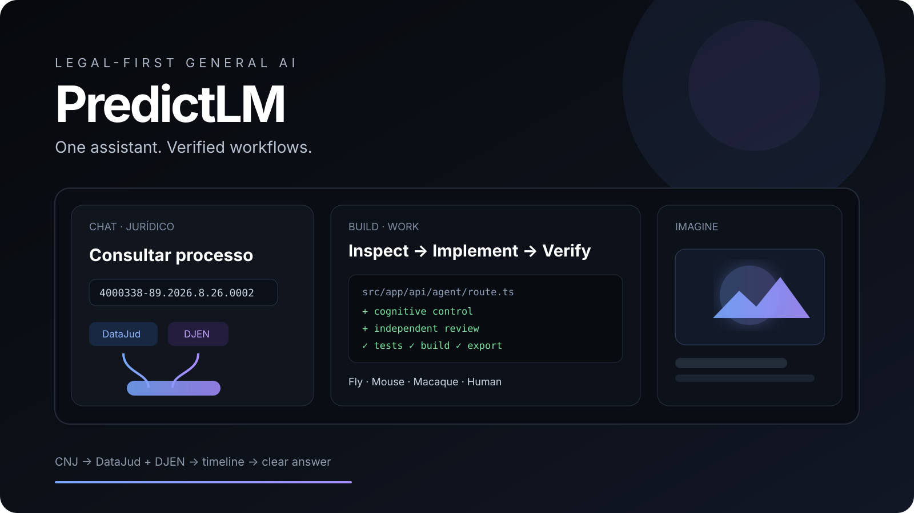
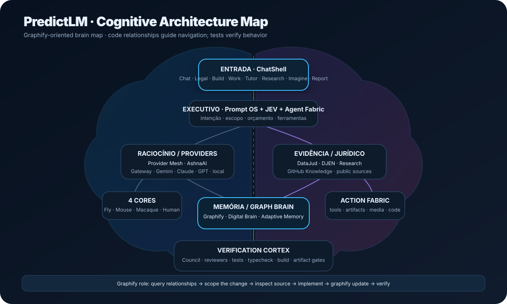
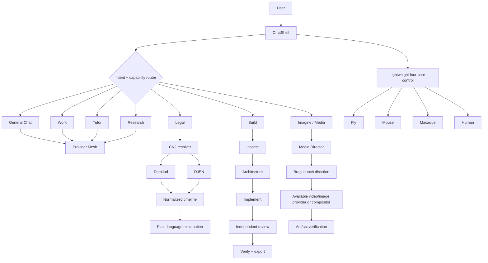

<div align="center">



<br />

# PredictLM

### General AI with a legal-first execution path

**One assistant. Verified workflows.**

**Chat · Jurídico · Imagine**

<br />

[](https://github.com/W2CAPITAL/PredictLm/actions/workflows/ci.yml)


<br />

[**Architecture**](ARCHITECTURE.md) ·
[**Security**](SECURITY.md) ·
[**Commercial film**](docs/commercial/predictlm-launch-film.md) ·
[**Agent contract**](AGENTS.md) ·
[**Master skill**](skills/predictlm-master/SKILL.md)

</div>

---

## Cognitive architecture map

<p align="center">
  
</p>

The repository can be mapped with **Graphify Brain** before cross-cutting changes. Graphify's structural graph is used to locate dependencies and paths, then the real source and deterministic checks remain authoritative.

```text
graphify query / path / explain
        ↓
scoped source inspection
        ↓
implementation
        ↓
graphify update
        ↓
typecheck · tests · build
```

Skill: [`skills/graphify-brain/SKILL.md`](skills/graphify-brain/SKILL.md)  
Map: [`docs/architecture/predictlm-brain-map.svg`](docs/architecture/predictlm-brain-map.svg)

## Product

PredictLM is built around one idea: **the user should not have to learn the application's internal architecture to get serious work done**.

Instead of splitting general chat, legal work, code execution, research, tutoring and media into disconnected products, PredictLM keeps one conversational entry point and activates specialized execution paths only when the task requires them.

<table>
<tr>
<td width="33%"><b>Chat</b><br/><sub>General questions, Build, Work, Research and Tutor.</sub></td>
<td width="33%"><b>Jurídico</b><br/><sub>CNJ → DataJud + DJEN → normalized timeline → clear explanation.</sub></td>
<td width="33%"><b>Imagine</b><br/><sub>Lightweight image/media entry point, loaded only when requested.</sub></td>
</tr>
</table>

> **Public surface:** Chat · Jurídico · Imagine  
> Build, Work, Tutor and Research are capabilities invoked from Chat, not extra top-level products.

Minecraft and connectome-driven neuroscience work remain **internal/lab infrastructure** rather than heavy top-level product surfaces. They stay outside the **primary navigation** so normal Chat and Jurídico do not inherit the cost of 3D simulation or large scientific datasets.

The Minecraft Cognitive World is the embodied-agent laboratory: Fly, Mouse, Macaque and Human controllers can be evaluated against navigation, perception, memory, planning, resource use and multi-agent interaction in a voxel-world setting. It is an independent research integration; PredictLM does not redistribute Minecraft assets and is not affiliated with or endorsed by Mojang or Microsoft.

The connectome layer is documented separately in [`CONNECTOME_SOURCES.md`](CONNECTOME_SOURCES.md) and [`COGNITIVE_WORLD_NEUROSCIENCE_LAB.md`](COGNITIVE_WORLD_NEUROSCIENCE_LAB.md). FlyWire, MICrONS, H01 and Allen resources are treated as scientific references/provenance for software-control abstractions, not as claims that PredictLM reproduces a biological brain or consciousness.

---

## What makes PredictLM different

| Principle | What it means in practice |
| --- | --- |
| **One assistant** | The public identity remains PredictLM regardless of which provider or internal capability executes the task. |
| **Evidence before confidence** | Legal and research flows preserve source failures and distinguish evidence from inference. |
| **Execution, not theater** | Build ends in reviewed files and deterministic checks; media is not called “generated” until an artifact exists. |
| **Provider independence** | Models and media providers are replaceable infrastructure, not the product architecture. |
| **Heavy features stay lazy** | Experimental labs, media modules and browser/local ML must not punish normal Chat startup. |
| **Verification is part of the feature** | Typecheck, tests, production build and export smoke are expected completion gates. |

---

## Core architecture



### Architectural rule

> **Routing and verification should stay deterministic where possible; generation should stay replaceable.**

A model can change. A provider can rate-limit. A media backend can disappear. The product contract should survive all three.

---

## Legal intelligence

PredictLM's legal path focuses on **public Brazilian process consultation and explanation**.

```text
CNJ number
  -> validate format
  -> resolve tribunal
  -> query DataJud
  -> query DJEN
  -> optional official-source fallback
  -> normalize events
  -> preserve partial success
  -> interpret procedural posture
  -> explain in plain language
```

### Legal invariants

- An empty public source does **not** prove that a process does not exist.
- DataJud and DJEN are treated as independent evidence sources.
- One source failing must not erase useful evidence returned by another.
- Missing data remains missing data; it is not silently converted into a legal conclusion.
- Filing, signature, payment and privileged-account actions remain human-gated.
- Source facts and model interpretation are deliberately separated.

**Primary implementation**

```text
src/app/api/legal/
src/lib/legal/server.ts
src/lib/legal/presentation.ts
src/lib/legal/dossier.ts
src/lib/legal/cnj.ts
```

---

## Build inside Chat

Build is an execution pipeline, not a separate tab.

```text
request
  -> inspect current workspace
  -> identify relevant files
  -> architecture plan
  -> implementation
  -> changed-code review
  -> bounded repair
  -> smoke / council / diff review
  -> runnable package
```

Incremental requests preserve the current project. A follow-up such as “deixe responsivo”, “corrija o login” or “mude apenas esta tela” patches the existing workspace instead of silently regenerating it from zero.

**Primary implementation**

```text
src/app/api/agent/route.ts
src/lib/build-orchestrator.ts
src/lib/build-diff-review.ts
src/lib/agent-runtime/
src/components/ChatShell.tsx
```

---

## Four-core cognitive control

PredictLM keeps four compact neuroscience-informed **software controllers** available across Chat, Legal, Build, Work, Tutor, Research, Imagine and Report.

| Core | Runtime role | Reference boundary |
| --- | --- | --- |
| **Fly** | Salience, fast filtering, bounded exploration, action selection | FlyWire-derived structural motifs |
| **Mouse** | Visual/spatial discrimination, coupling, uncertainty control | MICrONS + Allen references |
| **Macaque** | Visual hierarchy, regional integration, composition priors | Cortical atlas/projectome proxy |
| **Human** | Working memory, executive control, recurrent integration, metacognition | H01-informed fragment + explicitly labelled proxy coverage |

These are **control signals**, not simulated biological minds and not evidence of consciousness.

### Performance contract

- Normal product surfaces consume compact summaries only.
- Chat may persist local cognitive state.
- Stateless server routes use deterministic state to preserve cache stability.
- Cognitive-layer failure is non-blocking.
- Minecraft, 3D renderers, raw connectome datasets and Cognitive Lab UI are not required for normal Chat.

---

## Provider Mesh

### AshnaAI

PredictLM supports **AshnaAI** as a server-side OpenAI-compatible chat provider. A deployment can use a foundation model or an Ashna custom agent without changing the public PredictLM identity.

```dotenv
ASHNA_API_KEY=
ASHNA_BASE_URL=https://api.ashna.ai/v1/api
ASHNA_MODEL=glm-5.3-flash
ASHNA_AGENT_ID=
```

`ASHNA_AGENT_ID`, when present, takes precedence over `ASHNA_MODEL`. Credentials remain server-side. Ashna participates in the same health/cooldown and bounded provider-routing policy as the rest of the mesh.


PredictLM can route work across configured remote providers while keeping provider identity out of the public product.

```text
task
  -> classify
  -> rank configured providers
  -> health / cooldown policy
  -> attempt primary route
  -> bounded rescue route
  -> sanitize output
  -> public-answer gate
```

Server credentials stay outside the client bundle. Failed providers can enter cooldown instead of being called repeatedly.

**Relevant implementation**

```text
src/app/api/chat/route.ts
src/app/api/chat/stream/route.ts
src/lib/server/provider-mesh.ts
src/lib/server/provider-health.ts
src/lib/chat-trust-boundary.ts
src/lib/public-answer-gate.ts
```

---

## Imagine and video

### Public Imagine

The public Imagine path is deliberately small:

```text
prompt
  -> lightweight creative control
  -> image route
  -> validate returned pixels
  -> optional browser fallback
  -> display result
```

Cognitive/media modules are loaded dynamically only when generation is requested.

## Commercial launch film

Product-video requests use a Brag-inspired direction layer:

```text
inspect real product
  -> choose hook
  -> choose real user flow
  -> storyboard
  -> composition brief
  -> capability preflight
  -> render
  -> verify playable artifact
  -> poster
  -> share copy
```

Source: [`latent-spaces/brag`](https://github.com/latent-spaces/brag), MIT-licensed, adapted through [`skills/brag-launch-video/SKILL.md`](skills/brag-launch-video/SKILL.md).

### No Higgsfield dependency

**Higgsfield is not required to run PredictLM, use Brag, build the documentation, or execute the commercial workflow.**

The media architecture is provider-agnostic. A deployment can use whichever real path is actually available and configured — a temporal model, a self-hosted compositor, or a verified FFmpeg/composition path. Higgsfield may remain an optional external adapter/reference elsewhere in the repository, but **the core product does not depend on it**.

A storyboard is not a video. A submitted provider job is not a video. A video is considered complete only after a playable artifact is verified.

**Commercial assets**

- [Launch-film brief](docs/commercial/predictlm-launch-film.md)
- [Commercial poster](docs/commercial/predictlm-commercial-poster.svg)
- [Brag launch-video skill](skills/brag-launch-video/SKILL.md)
- [Source notes / attribution](skills/brag-launch-video/SOURCE-NOTES.md)

---

## Reliability model

PredictLM is designed around partial failure instead of pretending every dependency is always healthy.

| Failure | Expected behavior |
| --- | --- |
| DataJud unavailable, DJEN available | Preserve DJEN evidence and expose the DataJud failure. |
| Primary LLM provider rate-limited | Use a bounded healthy rescue route when configured. |
| Browser/local neural runtime unavailable | Keep hosted Chat usable. |
| Cognitive state unavailable | Continue with safe deterministic defaults. |
| Image provider returns invalid output | Reject before presentation. |
| Async video job never yields a playable file | Do not mark the task complete. |
| External research contains raw/debug payloads | Sanitize or reject at the trust boundary. |

The goal is **honest degradation** rather than fake success.

---

## Security posture

PredictLM keeps deployment credentials and operational security details out of public documentation. Protected remote capabilities require authenticated access, server-only secrets and bounded external actions.

Public documentation intentionally describes the security model only at a high level. Vulnerability details, private deployment addresses, credentials, incident notes and exploit reproductions should be handled through private disclosure rather than public issues or README content.

See [`SECURITY.md`](SECURITY.md) for the disclosure channel and deployment principles.

---

## Repository map

```text
PredictLm/
├── src/
│   ├── app/api/
│   │   ├── agent/            # Build execution
│   │   ├── chat/             # General AI + streaming
│   │   ├── legal/            # DataJud / DJEN
│   │   ├── media/            # Image + temporal video
│   │   ├── report-dossier/   # AI reports
│   │   └── health/           # deterministic health checks
│   ├── components/
│   └── lib/
│       ├── cognitive/
│       ├── legal/
│       ├── media/
│       ├── server/
│       └── fusion/
├── skills/
│   ├── predictlm-master/
│   ├── brag-launch-video/
│   └── ...
├── docs/commercial/
├── supabase/migrations/
├── tests/
├── scripts/
├── AGENTS.md
├── ARCHITECTURE.md
└── SECURITY.md
```

---

## Stack

| Layer | Technology |
| --- | --- |
| Web | Next.js 16.3.7 |
| UI | React 19.2.8 |
| Language | TypeScript |
| State | Zustand |
| Code editor | CodeMirror |
| Browser ML | Transformers.js + optional browser-local paths |
| Packaging | JSZip |
| AI routing | Server-side Provider Mesh |
| Legal | DataJud + DJEN normalization |
| Media | Provider cascade + optional temporal adapters/compositors |
| Tests | Node test runner + TSX |
| CI | GitHub Actions |

---

## Run

### Requirements

- Node.js 20+;
- npm;
- at least one configured remote AI provider for hosted inference, or an optional compatible local/browser path.

```bash
git clone https://github.com/W2CAPITAL/PredictLm.git
cd PredictLm
npm ci
cp .env.example .env.local
npm run dev
```

### Deployment credentials

Use [`.env.example`](.env.example) as the configuration contract. Owner sessions, external API clients and model providers use separate server-side credentials; client applications such as SheetsPredict should authenticate with a dedicated PredictLM API key rather than reusing an owner login credential.

Do not commit live credentials or private deployment addresses. Keep deployment-specific security notes outside the public repository and follow [`SECURITY.md`](SECURITY.md) for private disclosure.

---

## Quality gates

A change is not “done” because it looks correct.

```bash
npm run typecheck
npm test
npm run build
npm run eval:build-export
```

CI also runs:

```bash
npm audit --omit=dev --audit-level=high
```

Additional suites:

```bash
npm run eval:production
npm run eval:general
npm run knowledge:sync
npm run train:validate
```

```text
compile
  -> test
  -> production build
  -> deterministic export smoke
  -> merge
```

---

## Knowledge and skills

External repositories are treated as **versioned knowledge or architecture references**, not as unquestioned authority and not as automatic executable code.

```text
curated source registry
  -> provenance / license policy
  -> selected files
  -> chunk + deduplicate
  -> searchable knowledge
  -> bounded runtime context
```

Brag is registered as an MIT source for launch-video direction. Its bundled binary media assets are intentionally excluded from ingestion.

Graphify is registered as an Apache-2.0 code-intelligence source. Its graph is used for structural navigation and impact analysis; `EXTRACTED` and `INFERRED` relationships remain distinguishable, and graph output never overrides live source/tests.

Canonical behavior is still owned by:

```text
AGENTS.md
skills/predictlm-master/SKILL.md
live source code
tests/
```

---

## Engineering principles

1. **One public product surface beats a collection of demos.**
2. **Evidence outranks confidence.**
3. **Provider output is a candidate until it passes validation.**
4. **Heavy capabilities stay lazy or internal.**
5. **Project continuity outranks template regeneration.**
6. **Verification is part of execution.**
7. **External repositories contribute patterns with provenance, not authority.**
8. **A storyboard is not a video; a prompt is not an image; a plan is not implementation.**
9. **If the system cannot prove an artifact exists, it does not claim success.**

---

## Project status

PredictLM is an actively evolving engineering project.

**Current public focus**

- open-domain Chat;
- Brazilian legal-process consultation and explanation;
- Chat-native Build / Work / Tutor / Research;
- lightweight Imagine.

Experimental simulation, neuroscience and specialist media tooling remain available as internal modules or optional adapters without defining the public product. The Minecraft Cognitive World and four connectome-informed controllers remain first-class research components, loaded only when that laboratory is used.

## License

PredictLM is source-available under the terms in [`LICENSE`](LICENSE). Third-party code, models, datasets and research references retain their own licenses and notices; see [`THIRD_PARTY_NOTICES.md`](THIRD_PARTY_NOTICES.md).

---
<div align="center">

### PredictLM

**One assistant. Verified workflows.**

[Architecture](ARCHITECTURE.md) · [Security](SECURITY.md) · [License](LICENSE) · [Commercial film](docs/commercial/predictlm-launch-film.md)

</div>
