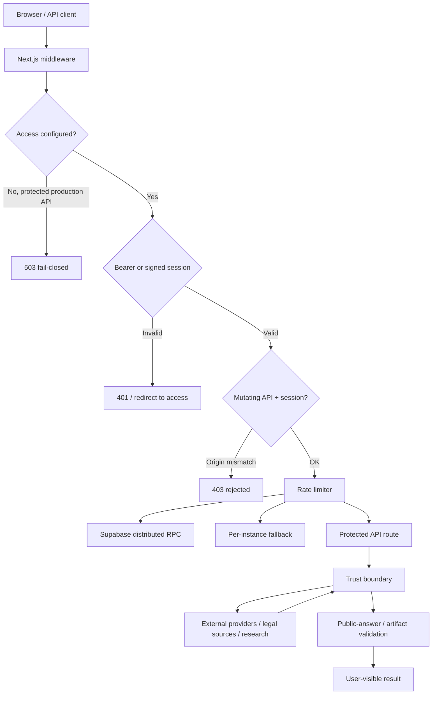

<div align="center">

# PredictLM Security

### Defense-in-depth for an AI application that touches external APIs, legal data, code generation and media workflows


**Security is part of the runtime contract, not a deployment afterthought.**

[Production checklist](#production-deployment-checklist) ·
[Threat model](#threat-model) ·
[Controls](#security-controls) ·
[Disclosure](#responsible-disclosure)

</div>

---

## Security model

PredictLM combines several risk domains:

- authenticated remote APIs;
- external AI/model providers;
- public legal-data sources;
- user-controlled prompts and files;
- generated code;
- URL inspection/research;
- optional media providers;
- external publishing capabilities;
- automated learning workflows.

The design follows four rules:

1. **Fail closed for protected production APIs.**
2. **Keep credentials server-side.**
3. **Treat external content and model output as untrusted until validated.**
4. **Require explicit human confirmation for actions with external side effects.**

---

## Threat model

| Threat | Primary control | Residual risk |
| --- | --- | --- |
| Unauthorized API use | Access token + signed session + middleware enforcement | Deployment owner must provision strong independent secrets |
| Session theft via client JS | HttpOnly cookie | Browser/device compromise remains out of scope |
| Cross-site mutation using session auth | Same-origin `Origin` check on non-GET API requests | Compromised same-origin code remains trusted |
| API abuse / runaway cost | Bucketed rate limits; distributed Supabase RPC when configured | Local fallback is per-instance and weaker in multi-instance environments |
| Timing attacks on access-token comparison | SHA-256 digest + timing-safe comparison | Secret quality still matters |
| SSRF / metadata access | DNS-aware public-URL validation + redirect revalidation | Network-layer egress controls remain stronger |
| Prompt injection / raw provider leakage | Trust-boundary sanitization + public-answer gate | Semantic attacks can still require product-specific validation |
| Generated-code regressions | Build review + deterministic tests/build/export gates | Tests cannot prove absence of every defect |
| Unapproved social publishing | Auth + explicit `confirmPublish: true` | External publisher security is outside this repository |
| Automated learning writing directly to production | Bot branch + pull request workflow | Maintainers must review before merge |
| Secret leakage into media/docs | Server-only env policy + Brag/media privacy contract | Human-authored content still needs review |
| Supply-chain vulnerabilities | `npm audit` + lockfile + CI | Audit databases do not cover every possible vulnerability |

---

## Security architecture



---

## Security controls

### 1. Production access control

Production is intentionally **fail-closed** for protected remote APIs when `PREDICTLM_ACCESS_TOKEN` is not configured.

Required server-only secrets:

```bash
PREDICTLM_ACCESS_TOKEN=
PREDICTLM_SESSION_SECRET=
PREDICTLM_RATE_LIMIT_SECRET=
```

Recommended distributed-rate-limit configuration:

```bash
PREDICT_SUPABASE_URL=
PREDICT_SUPABASE_SERVICE_ROLE_KEY=
```

Never expose these through `NEXT_PUBLIC_*`.

### 2. Signed sessions

Browser access uses an expiring HMAC-signed session value.

Implementation properties:

- cookie: `predictlm_access`;
- `HttpOnly: true`;
- `SameSite: Strict`;
- `Secure: true` in production;
- bounded lifetime;
- the deployment access token is not stored inside the session value;
- access-token verification uses timing-safe digest comparison.

Implementation: `src/lib/server/access-control.ts`.

### 3. CSRF boundary

For authenticated browser sessions, mutating API requests are checked against the deployment origin.

```text
session-authenticated
+ mutating method
+ missing or foreign Origin
= 403 CSRF_ORIGIN_REJECTED
```

Bearer-authenticated API clients are handled separately.

Implementation: `middleware.ts`.

### 4. Rate limiting

The middleware uses two broad API buckets:

| Bucket | Current policy |
| --- | ---: |
| Expensive AI/media/research/legal-dossier routes | 30 requests / 60 s |
| Standard API routes | 120 requests / 60 s |

When Supabase service credentials are configured, the limiter calls the service-role-only `predict_take_rate_limit` RPC.

If the distributed backend is unavailable, the runtime falls back to an in-memory per-instance limiter. That fallback is useful for continuity but **is not a globally distributed production limit**.

Relevant migration: `supabase/migrations/20260929_api_rate_limit.sql`.

### 5. SSRF protection

Server-side URL inspection is restricted to public destinations.

The guard rejects or revalidates:

- loopback addresses;
- RFC1918/private networks;
- link-local ranges;
- internal hostnames;
- cloud metadata-style hosts;
- redirect chains that resolve into a disallowed target.

Relevant implementation: `src/lib/server/public-url.ts`.

> Application-level URL validation materially reduces SSRF exposure. Infrastructure egress policies remain a stronger additional layer and are recommended for high-assurance deployments.

### 6. Provider and secret isolation

Provider keys belong to server configuration.

Rules:

- do not use `NEXT_PUBLIC_*` for secrets;
- do not place API keys in generated code or client state;
- browser-local optional providers must follow their own explicit user-auth model;
- provider transport/debug output is not automatically user-visible;
- remote provider identity never becomes the public identity of PredictLM.

### 7. LLM / prompt trust boundary

Research results, external API content, retrieved text and provider output are treated as untrusted.

PredictLM includes gates for:

- debug/stdout/header leakage;
- raw external payload leakage;
- internal runtime metadata;
- accidental chain-of-thought-style content;
- malformed structured output;
- wrong-language output;
- unrelated operational monologues.

Relevant implementation:

```text
src/lib/chat-trust-boundary.ts
src/lib/public-answer-gate.ts
src/lib/chat-intelligence.ts
```

This is a defense layer, not a claim that prompt injection is solved.

### 8. Generated-code boundary

Build output is reviewed before packaging.

```text
inspect
  -> plan
  -> implement
  -> independent changed-code review
  -> bounded repair
  -> smoke / test / build gates
  -> export
```

Generated code should not receive production credentials during generation or test unless a deployment workflow explicitly provides scoped secrets.

### 9. External side effects

PredictLM separates analysis from actions that affect external systems.

Example: `/api/social/publish` requires:

- authenticated access; and
- explicit `confirmPublish: true`.

The same principle applies to legal filing, signature, payment and privileged-account activity: these remain human-gated.

### 10. Automated learning / self-improvement

Scheduled learning workflows are not allowed to push generated commits directly into `main`.

```text
generate / update
  -> bot-owned branch
  -> pull request
  -> review
  -> merge
```

The test suite verifies that scheduled learning workflows do not contain direct `git push ... main` behavior.

### 11. Media and Brag workflows

Launch-video/product-media inspection must not export:

- `.env` contents;
- API keys/tokens;
- private URLs;
- real customer/client data;
- internal logs;
- unsupported product claims.

Brag is a direction layer. **Higgsfield is not a security dependency or runtime requirement.**

Media providers are optional adapters and should receive only the minimum data required for the requested generation.

---

## Database security

### Required migrations

The following security-sensitive migrations must ship with the matching application code.

#### Distributed rate limiting

```text
supabase/migrations/20260929_api_rate_limit.sql
```

Creates rate-limit state and the service-role-only RPC used by middleware.

#### Workspace proof RLS

```text
supabase/migrations/20260929_workspace_secret_proof_rls.sql
```

The request carries an ephemeral workspace proof while PostgreSQL performs the comparison against the stored hash. A stored `workspace_secret_hash` should not itself be reusable as the request credential.

**Deployment ordering matters:** do not apply a migration that changes a credential contract before deploying the application route that speaks the new contract.

---

## Secrets

### Never commit

- `.env`
- `.env.local`
- access/session/rate-limit secrets
- provider API keys
- Supabase service-role keys
- OAuth client secrets
- real client legal data used only for development/testing

### Prefer

- independent high-entropy values for access/session/rate-limit secrets;
- platform-managed encrypted environment variables;
- environment separation between development, preview and production;
- scoped provider keys;
- regular key rotation after suspected exposure.

If a secret is committed, deleting it from the latest commit is **not enough**. Revoke or rotate it first, then clean repository history if required.

---

## Production deployment checklist

### Access and session

- [ ] `PREDICTLM_ACCESS_TOKEN` is configured.
- [ ] `PREDICTLM_SESSION_SECRET` is independent from the access token.
- [ ] `PREDICTLM_RATE_LIMIT_SECRET` is independent and high entropy.
- [ ] No server secret uses `NEXT_PUBLIC_`.
- [ ] HTTPS is enforced by the hosting platform.

### Rate limiting and database

- [ ] `20260929_api_rate_limit.sql` is applied.
- [ ] `PREDICT_SUPABASE_URL` is configured when distributed limiting is required.
- [ ] `PREDICT_SUPABASE_SERVICE_ROLE_KEY` is server-only.
- [ ] Workspace-proof RLS migration and feedback route are deployed as one compatible change.

### Providers and external services

- [ ] Only intended providers have credentials.
- [ ] Unused provider keys are absent.
- [ ] External base URLs use expected HTTPS hosts.
- [ ] Media generation sends no unnecessary PII.
- [ ] Higgsfield is not assumed; absent optional adapters do not block the core app.

### Verification

- [ ] `npm audit --omit=dev --audit-level=high`
- [ ] `npm run typecheck`
- [ ] `npm test`
- [ ] `npm run build`
- [ ] `npm run eval:build-export`
- [ ] Access-denied and rate-limit behavior have been exercised in the deployment environment.

---

## CI security gates

The primary CI workflow executes:

```bash
npm ci --no-audit --no-fund
npm audit --omit=dev --audit-level=high
npm run typecheck
npm test
npm run build
npm run eval:build-export
```

Security-sensitive regression coverage includes:

```text
tests/security-hardening.test.ts
tests/chat-trust-boundary.test.ts
tests/product-focus.test.ts
```

A green CI run is evidence that these gates passed for a specific commit; it is not a formal security certification.

---

## Responsible disclosure

Please avoid publishing exploit details, working credentials, private client data or a weaponized proof-of-concept in a public issue.

Preferred reporting path:

1. Use GitHub's **private vulnerability reporting / Security Advisory** flow for this repository when available.
2. Include the affected commit/route, impact, prerequisites and minimal reproduction.
3. Redact credentials, customer information and unrelated private data.
4. Allow maintainers to reproduce and patch before public technical disclosure.

If private vulnerability reporting is unavailable, use a private channel controlled by the repository owner rather than a public issue containing exploit details.

### Useful report structure

```text
Title
Affected component / route
Affected commit or deployment
Impact
Prerequisites
Minimal reproduction
Observed result
Expected security boundary
Suggested mitigation (optional)
```

Do not include active secrets. If a real secret was exposed, state that it was exposed and rotate it separately.

---

## Incident response

For a suspected production compromise:

1. **Contain** — disable or revoke affected provider/deployment credentials.
2. **Rotate** — access token, session secret, rate-limit secret and affected provider keys.
3. **Invalidate** — redeploy after session-secret rotation to invalidate prior signatures.
4. **Inspect** — provider logs, platform logs, Git history and recent deployment changes.
5. **Patch** — apply the smallest verifiable remediation first.
6. **Verify** — rerun security tests, CI gates and the exploit reproduction.
7. **Document** — affected surface, root cause, blast radius and prevention.
8. **Restore** — re-enable integrations only after validation.

---

## Security boundaries / non-goals

Application controls do not replace:

- host-level network egress restrictions;
- cloud IAM;
- managed secret storage;
- provider-side abuse prevention;
- browser/device security;
- database backups and disaster recovery;
- independent penetration testing;
- legal/compliance review required by a particular deployment.

PredictLM aims for **clear application boundaries, safe defaults and regression-tested controls** while remaining explicit about what the deployment environment must provide.

---

<div align="center">

### Security invariant

**No secret in the client. No external action without an explicit gate. No artifact declared complete before verification.**

[Back to README](README.md) · [Architecture](ARCHITECTURE.md) · [Agent rules](AGENTS.md)

</div>
